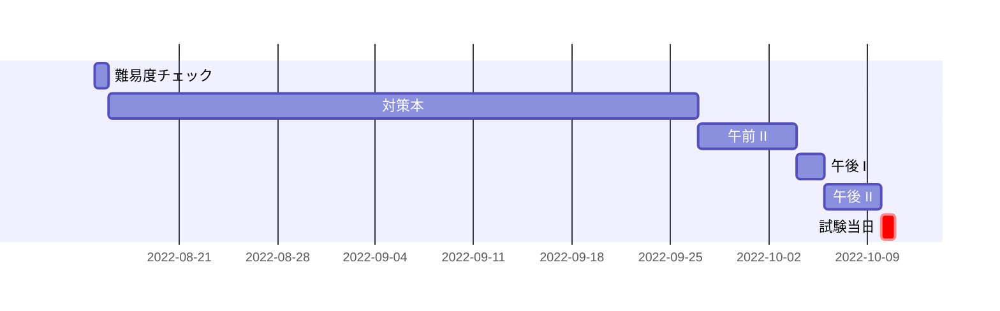

情報処理安全確保支援士試験(SC)を受験し、無事合格したのでその体験記(多分参考になりません)です。

## 私のプロフィール

-   高専卒(情報工学科)
-   社会人/ソフトウェア開発 2年目
-   基本情報技術者試験(FE) 平成31年度春期 合格
-   情報セキュリティマネジメント試験(SG) 令和3年度上期 合格
-   応用情報技術者試験(AP) 令和4年度春期 合格

令和4年度春期に応用情報に合格しているので、今回は午前I免除でした。

なお今回行った勉強法はFE, SG, APで行った試験対策と同じです。

## 受験の理由

今の自分が応用情報の上に位置する高度情報処理技術者試験や情報処理安全確保支援士(以降、レベル4の試験と呼びます)に合格できる実力があるのかの**力試し**です。

というのも、私の知っている中で友人(学生時代の同級生や、会社の同期)でレベル4の試験に合格している人がいませんでした。

応用情報技術者試験は学生時代に取得した同級生が何人かいて、リアルタイムで学習過程や感想を聞いていたので私でも合格出来そうだなという感覚はありましたが、レベル4の試験に関しては未知でした。

それで若干の興味もあり、もちろんレベル4の試験にも難易度の差はあると思いますが、とりあえず情報処理安全確保支援士を受けることにしました。

あと、合格したらいくらかの報奨金が出るのもモチベーションアップになりました。報奨金が無ければ受けていたか正直微妙なところではあります。

## 試験対策

私の試験対策は以下を大切にしています。

-   試験の出題範囲について、網羅的に解説している本を一読する
-   スケジュールは立てない

なので万人にはオススメできる勉強法ではないと思います(特に効率的に勉強して効率的に合格することを目標としているひとや、完璧(全部90点以上)とかを目標にしている人)。すみません。

こういう勉強をする人もいるんだと参考程度にしていただければと思います。

### 対策時間

おおよそ計50時間です。

以下は各対策にかけた時間です。

| 対策内容 | 時間(h) |
| :------: | :-----: |
|  対策本  |   35    |
| 午前 II  |    4    |
|  午後 I  |    2    |
| 午後 II  |    7    |

日程はおおよそ以下のようなかんじでした。

先述の通り私はあらかじめスケジュールは立てていません。

立てるべきなのはもちろんそうなのですが、あくまで趣味で別に仕事じゃないし、「○○までにxxをしないと…」となるのは非常にストレスを感じるので、やることだけ決めて日程は行き当たりばったりで行いました。まあ、いままでもこれで情報技術者試験は合格しているからいいかなと思っています。
試験勉強開始時には、最終的に午後IIの過去問を何問か解ければいいかな程度に考えていました。

### 難易度チェック

ここから先は、行った対策の内容についてのお話です。

まずはじめに今回受ける試験について、どんな感じの難易度/問題なのかを軽く把握しました。

具体的には以下を行いました。

-   午前IIの問題を10-20問解く
-   午後Iの問題を1問解く
-   午後IIの問題を1問解く

先ほど力試しといったように、今まで私はSCは応用情報技術者試験よりもはるかに難しく、実務を数年している人が何度も受験してやっと合格するものだと思っていました。

そのため、本当に今の自分が受けられない難易度の試験であれば今までの情報技術者試験に比べて勉強の質と量を大幅に上げないといけないなと思っていたので、そのために難易度を把握したかったです。

確認した結果としては、前回応用情報技術者試験を受けるときに感じたハードルよりもほんの少し高いなっていう程度だったので、いつも通りの感じでいいかなとなりました。

### 対策本を読む

[情報処理教科書 情報処理安全確保支援士 2022年版](https://www.seshop.com/product/detail/24727)を購入して、一通り読みました。

@[card](https://www.seshop.com/product/detail/24727)

私にとっては、体系的な知識を身に着けることに大事だと思うので、今までの情報処理技術者試験でも、まず対策本を読むことにしています。

これを読んでいる人で、今から基本情報技術者試験(FE)とか応用情報技術者試験(AP)を受ける人は少ないと思いますが、特にFE, APを受けるときはこれが重要なのかなと思います。(将来受ける上のレベルの試験に向けて、知識の土台を広げておいた方が良いため)

この本を選んだ理由は、これはこの本を購入できる[SEshop.com](www.seshop.com)の以下の点が魅力的だったからです。

-   定期的に50%ポイント還元キャンペーンを行っている
    -   いつもの10%OFFクーポンと合わせてかなりお手頃価格で手に入れることができます。
-   PDF版が手に入る

サービス終了やアカウント削除により書籍がなくなってしまうことの不安から私は技術書はPDF版の書籍を買うことが多いです。ただ、対策本は普通の技術書と違い一時しか読まないので、安ければ正直KindleとかKoboでいい気もします。

技術書の 紙版 vs 電子書籍問題ですが私は電子書籍一択です。電子書籍はいつでも・どこでも・どの態勢でも見られるのがメリットだと思います。

日程を見ると期間のわりに学習時間が短いですが、中だるみして途中書籍を読まない日も多かったからです。

### 午前IIの過去問を解く

こちらのサイトを使って、令和元年度秋期 ~ 令和4年度春期まで計5期125問+その他年度の問題を100問ほど解いています。

途中から8割前後の正答率になったので、切り上げて午後の問題を解きました。

@[card](https://www.sc-siken.com/sckakomon.php)

### 午後Iの過去問を解く

IPAで公開されている過去問のうち、以下の3問を解きました。

-   平成30年度秋期試験 午後I 問1
-   令和2年度秋期試験 午後I 問1, 問2

@[card](https://www.jitec.ipa.go.jp/1_04hanni_sukiru/_index_mondai.html)

途中で午後Iの対策は午後IIの問題を解くので十分だなと感じたため、午後IIの過去問を解くことにしました。試験期間まであまり時間がなかったのもあります。

ちなみに、私が用いた対策本の[情報処理教科書 情報処理安全確保支援士 2022年版](https://www.seshop.com/product/detail/24727)は、過去問の解説が載っているので午後I, IIはこの本の解説を見ました。他の解説書を見ていませんが、私が欲しい解説は載っていたと思います。

### 午後IIの過去問を解く

午後Iと同じくIPAの過去問を解きました。解説は前述の対策本のものを見ています。

計5問解きました。記述式の自己採点なので甘い採点だったかもしれませんが、どの問題も大体7割とれているかなといった感じでした。

-   平成30年度秋期試験 午後II 問1, 問2
-   令和元年度秋期試験 午後II 問1
-   令和2年度秋期試験 午後II 問1, 問2

## 試験当日

受験申込締切日ギリギリに申し込んだこともあり、試験会場が自宅からドアtoドアで2時間程かかる場所になりました。大半が電車に乗車している時間とはいえ行き来だけで疲れます。

以降は受験当時の心境を書いています。

参考までに私の解いた令和4年度秋期のリンクを下に貼ります。

@[card](https://www.jitec.ipa.go.jp/1_04hanni_sukiru/mondai_kaitou_2022r04.html#04aki)

### 午前I

午後Iは令和4年度春期に応用情報技術者試験を合格していたので免除でした。

午後I免除の何が嬉しいって、試験会場に到着しないといけない時間が免除した分(50分)遅くても良いことですよね。

### 午前II

午前IIは過去問から流用されている問題は対策していたこともあり、それなりに正解していたのかなといった感触でした。

初めて見る問題も少なくとも何問かは正解している自信があったので、6割以上の正解は(マークミスとかを除けば)確実と見ていました。

退室可能時間がなかったので、1度見直ししたあとは暇していました。

### 午後I

問1と問3を解きました。

問2はJavaという文字があり、私はJavaに疎いので問1,問3が解けそうだったこともあり、解きませんでした。

大きくつまずくことはなく、満足するだけの見直しも行ったので、20分程時間を残して退室しました。

なので解答時間は70分です。

### 午後II

問1を解きました。

設問3 (2),(3) の記号をたくさん入れるのは、配点がわからないこともあり記入ミスや勘違いによる間違いが非常に怖かったです。

早く帰宅したかったのもあり、何度か見直して50分程残して退室しました。

なので解答時間は70分です。

## 試験結果を受けて

とりあえず、合格して嬉しかったです。

午前IIは試験中に少なくとも60%は取れている自信はありましたが、午後I,IIは長文&記述問題なのでそこまで自信がありませんでした。

午後IIは問1を解いたのですが、ARPスプーフィングの詳細を理解しておらず、回答が複数の解答欄に記述するものにもかかわらず半分以上間違った解答をしてしまいました。その他にも間違いがあることを踏まえると、今回は合格厳しいな…と思っていました。

最終的にはどれも70点以上取れたので、そこまでぎりぎりではなく(もちろんいい点数ではないとは自覚していますが)、良かったなと思います。

## 最後に

余談ですが、今回も前回の応用情報を受けた時も、最寄り駅に到着すると同じ目的で下車したのだろうなという人が多かったです。私は地図を読むのが大の苦手なのですが、その人たちが作る列についていくと自然と会場に到着するので面白く、楽をさせてもらいました。
私は大学受験とかしたことないのですが、大学受験のときも同じような感じなのかな?

次は[ネットワークスペシャリスト試験](https://www.jitec.ipa.go.jp/1_11seido/nw.html)を受けたいなと思っています。しかし、いい加減に逃げ続けたTOEICに取り組まないとな…といった状況です。英語を勉強しなくていいくらいのスーパーでパーフェクトな翻訳アプリが今すぐにでも完成しないですかね…。
