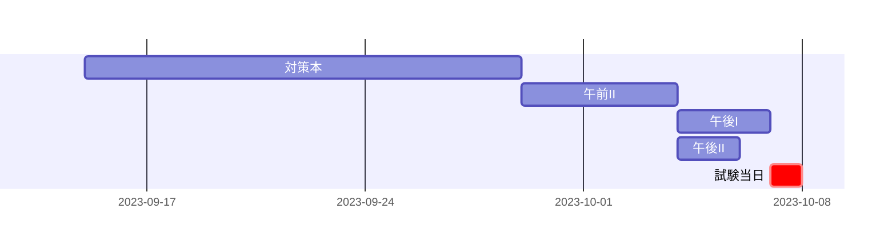

エンベデッドシステムスペシャリスト試験(ES)を受験し、無事合格したのでその体験記(多分参考になりません)です。

## 受験時の私のプロフィール

-   高専卒(情報工学科)
-   社会人/ソフトウェア開発 3 年目
-   それなにり Linux に触れるようになって 3 年目

## 過去に合格した情報処理技術者試験

| 試験名                               | 合格時期       |
| ------------------------------------ | -------------- |
| 基本情報技術者試験(FE)               | 平成31年度春期 |
| 情報セキュリティマネジメント試験(SG) | 令和3年度上期  |
| 応用情報技術者試験(AP)               | 令和4年度春期  |
| 情報処理安全確保支援士試験(SC)       | 令和5年度秋期  |

## 受験の理由

令和5年度秋期の試験で受験できる以下のまだ合格していない情報処理技術者試験の中で、自身の経歴から一番合格しやすそうな試験だったからです。

-   プロジェクトマネージャ試験（PM）
-   データベーススペシャリスト試験（DB）
-   エンベデッドシステムスペシャリスト試験（ES）
-   システム監査技術者試験（AU）

私は学生時代に高専ロボコンに参加していたので、少しだけ組み込み系の知識があると思っていました。

仕事では組み込み系の知識はほぼ使わないのでどんどん忘れていると思いますが、それでも他の試験よりは合格しやすいと思ったので受験しました。

あと、合格したらいくらかの報奨金が出るのもモチベーションアップになりました。

## 試験対策

私の試験対策は以下を大切にしています。

-   試験の出題範囲について、網羅的に解説している本を一読する
-   スケジュールは立てない

なので万人にはオススメできる勉強法ではないと思います(特に効率的に勉強して効率的に合格することを目標としているひとや、完璧(全部90点以上)とかを目標にしている人)。すみません。

こういう勉強をして、合格した人もいるんだと参考程度にしていただければと思います。

### 対策時間

おおよそ計33時間です。

以下は各対策にかけた時間です。

午前I は免除のため対策していません。

改めてみるとかなり対策している時間が短いなと思いました。

| 対策内容 | 時間(h) |
| :------: | :-----: |
|  対策本  |   15    |
|  午前II  |    5    |
|  午後I   |    5    |
|  午後II  |    8    |
|   合計   |   33    |

日程はおおよそ以下のようなかんじでした。

### 対策本

[情報処理教科書 エンベデッドシステムスペシャリスト 2023年版](https://www.seshop.com/product/detail/25522)

@[card](https://www.seshop.com/product/detail/25522)

### 午前II対策

午前II は、下記サイトの過去問を解きました。

[エンベデッドシステムスペシャリスト過去問対策.com](https://ids.information.jp/es/)

@[card](https://ids.information.jp/es/)

解いた過去問は平成26年度春期午前Ⅱから令和03年度秋期午前Ⅱの8年分です。

年度によっては2-3回解いています。

大体8割以上は正解できるようになったら、午前II の対策を終了しました。

## 午後I

対策本([情報処理教科書 エンベデッドシステムスペシャリスト 2023年版](https://www.seshop.com/product/detail/25522))に午後Iの演習(過去問)があったので、それを解きました。

2つの過去問を解きました。

-   令和4年度 秋期 午後II 問1
-   令和4年度 秋期 午後II 問2

エンベデッドシステムスペシャリストは他の情報処理技術者試験よりもインターネット上に過去問の解説が少ないので、解説などが必要であれば対策本を買うのがいいと思います。

## 午後II

対策本([情報処理教科書 エンベデッドシステムスペシャリスト 2023年版](https://www.seshop.com/product/detail/25522))に午後Iの演習(過去問)があったので、それを解きました。

1つの過去問を解きました。

-   令和4年度 春期ITストラテジスト 午後II 問1

論述試験の対策には下のYouTube動画も参考になりました。

@[card](https://youtu.be/NLzYZ605pO4?si=HE7QJi41laMfsBwT)

過去問を1つ解いた後に、試験で書く文章の設定を構築しました。

## 試験当日

### 午前I

昨年の情報処理安全確保支援士試験に合格していたため、午前Iを免除しました。

### 午前II

過去問から流用されている問題も多く、余裕を持って解くことができました。

### 午後I

問1と問2をぱっと見て、答えやすそうな問2を解きました。

今まで情報処理技術者試験の午後問題は途中退出することが多かったのですが、今回は試験時間の90分のフルで使い切って何とか解き終えました。

きちんと理解もできていないまま解いた問題もあったので、結果の点数も65点とかなりギリギリでした。

### 午後II

問1は企画、問2はマルチコア、問3は組み込みシステムの選定・設計・評価で、私の経験から問3が一番得意そうだったので問3を解きました。

事前に設定した文章の構成を頭に入れていたので、それを問3の形式に合わせるように再構成して解きました。

恥ずかしながら、対策も通して初めて時間を意識して論述試験を解いたので、午後Iと同様、午後IIも試験時間ぎりぎりで解き終えました。

考えるよりも、書くことの方が時間がかかってしまったので、次回はもう少し早く書けるようにしたいです。

かなり時間に余裕がなく、最後の設問ウはとりあえず文字数を満たすことを目標に書きなぐり、なんとかどの設問も規定文字数を満たすことができました。

数百文字分の文章を消して改めて書き直していた時はかなり焦りました。午後IIは何度も過去問を時間を意識して解いて慣れておくことが大事だと実感しました。

また、論述の中に実際の製品名を書かない方がいいということを知らなかったので、何度も実際のマイコン製品名を書いてしまいました。減点をされているのかもしれませんが、結果的には合格できたので大丈夫だったのかもしれません。

## 試験結果を受けて

初めての論述試験でなかなか大変でしたが、合格できてよかったです。

試験対策で自分の中にストーリーを作っておくことが大事だと感じました。今回はそのおかげでなんとか解き終えることができました。
