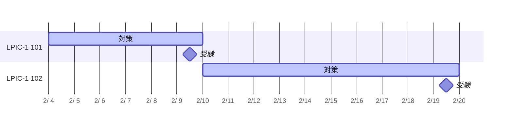

LPIC-1 を受験し、無事合格したのでその体験記です。

以下に101と102の試験結果を示します。
画像が大きいため折りたたんでいます。

:::details 試験結果詳細

:::

## 私のプロフィール

- 高等専門学校 情報工学科 卒業
- ソフトウェア開発職4年目
- インフラエンジニアではない
- 2023年にLinux Essentialsに合格

## 受験の理由

以下の3つの理由から受験しました。

- 業務でLinuxを触る機会が多く、Linuxの知識を体系的に学びたい
- 昨年度はLinux Linux Essentialsに合格したので、その次のステップとしてLPIC-1を受験
- 毎年資格試験を受けているので、今年も何か受けようと思い立った

## 試験対策

受験を思い立ったのが2月で、2月中に合格することを目標にしていたので、試験対策は[Ping-t](https://mondai.ping-t.com)のみで行いました。

@[card](https://mondai.ping-t.com)

## 対策時間と日程

LPIC-1 101に対する対策は約12時間で6日間かけ、LPIC-1 102に対する対策は約17時間で10日間かけました。

## LPIC-1 Exam 101

Ping-tの問題集を以下のステップで解きました。

1. すべての問題を解き、解説を読む
2. ミスをした問題を復習する
3. 模擬試験を受ける、もしくは模擬試験を受ける時間がない場合は、ランダムで問題を解く

101の対策では同じ問題も繰り返し解いたので、合計1379問の問題を解きました。

時間にすると、おおよそ12時間ほど対策を行いました。

個人的な感想としては、101の範囲は私が普段使っているコマンド等の知識やLinux Essentialsで学習して覚えている範囲と重複している部分が多かったため、それほど難しく感じませんでした。

実際に初見で解く問題の正答率は70-80%程度で、後は間違えた問題に関する知識をつけて、模擬試験で安定して90%以上の正答率となるように学習していました。

私に元々足りていなかった知識は、日頃触れないGRUBやZypper、ファイルシステムあたりです。

記述式問題は、ファイル名やコマンド等の簡単なものということだったので、特に対策はしていません。

## LPIC-1 Exam 102

対策のステップとしては101と同様で、LPIC-1 Exam 102の問題集を解いていました。

1494問の問題を解き、おおよそ17時間ほど対策を行いました。

個人的には101よりも102の方が難しかったです。
初見で解く問題の正答率は60%程度で、101よりもしっかりと学習する必要があると感じました。

例えばプリンタの設定やnmcliの使い方の部分で躓き、特にnmcliは各種サブコマンドを覚えるのに時間がかかりました。

101と同様に、記述式問題は対策はしていません。

Ping-tの101の問題集は無料で利用できますが、102の問題集は有料のプレミアムプランが必要です。プレミアムプランは長期契約ほど割引が大きくなるため、今後LPIC-2も受験する予定がある私は6ヶ月プランを契約しました。

## 試験当日

試験日程に記載した通り、それぞれ別の日に受験しました。

オンラインでの受験も考えましたが、試験の数日前に予約しようとしたところ、試験センターの方が空いていたため、試験センターで受験しました。

Ping-tの問題集を解いていたので、問題の難易度はそれほど高くありませんでした。しかし、Ping-tで出てきた問題がそのまま出題されるわけではないため、問題を解くだけでなく、問題に関する知識をしっかりと身につけることが重要だと感じました。

また、試験が終了した瞬間にスコアが表示され、その場で合格したかどうかがわかるのは良かったです。すぐに次の試験に向けて対策を始めようと思いました。

個人的に一番つらかったのは、試験会場のPCにつながっているポインティングデバイスがマウスだったことです。私はマウスを使うと手が痛くなるため普段はトラックボールを使っていますが、もちろん試験会場にはトラックボールはありません。キーボードだけで回答もできたので、無事に手が痛くなることなく試験を終えることができました。

## 感想

LPIC-1に無事合格できて本当に良かったです。インターネット上では新卒や未経験の方がすぐに合格したという話も多く、4年目のエンジニアである私が学習するのは遅いのかなと思うこともありました。しかし、これまで開発作業中にあまり理解せずに使っていたコマンドや設定について深く理解することができたので、受験して本当に良かったと思います。

今回はPing-tの問題集のみで対策を行いましたが、LPIC-2の対策では「あずき本」を使ってより体系的に学習し、その後にPing-tの問題集で理解度を確認するようにしようと思います。

@[card](https://www.shoeisha.co.jp/book/detail/9784798151250)
